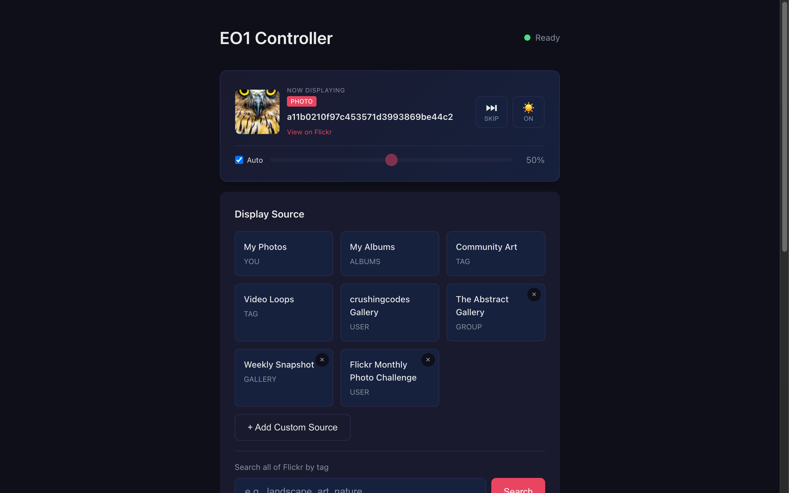

# EO1 Web Controller

<div align="center">
  
</div>

<div align="center">

[](https://nodejs.org/)
[](https://opensource.org/licenses/MIT)
[]()

</div>

Control your Electric Objects EO1 digital art display from any device — iPhone, Mac, or anything with a browser.

<div align="center">

### Quick Start

```bash
git clone https://github.com/davemac/eo1-web-controller.git && cd eo1-web-controller && npm install && npm start
```

Open **http://localhost:3000** and enter your Flickr API key.

</div>

---

## TL;DR

**The Problem**: [Electric Objects shut down in 2023](https://theharanguer.com/2023/07/a-eulogy-to-the-electric-objects-e01/), bricking thousands of displays. The community-built [spalt/EO1](https://github.com/spalt/EO1) replacement app brought them back to life, but its companion Partner app is Android-only — no option for iPhone users.

**The Solution**: A web-based controller that runs on your local network, letting you browse Flickr, send art to your EO1, and control brightness/slideshows from any device with a browser.

### Why Use EO1 Web Controller?

| Feature | What It Does |
|---------|--------------|
| **Any Device Control** | Works on iPhone, iPad, Mac, Windows — anything with a browser |
| **Smart Filtering** | Find portrait images that actually fit the EO1's vertical display |
| **Flickr Browser** | Browse users, tags, groups, galleries, albums, and search results |
| **Remote Access** | Control from anywhere via Tailscale (not just your home network) |
| **Save Presets** | Bookmark your favourite Flickr sources for quick access |
| **Portrait Detection** | Automatically identifies images optimised for vertical display |

---

## Quick Example

```bash
# 1. Start the server
npm start

# 2. Open in browser
open http://localhost:3000

# 3. Enter your Flickr API key in Settings

# 4. Click a preset (e.g., "Flickr Explore")

# 5. Browse photos, click one you like

# 6. Click "Display on EO1" — art appears on your wall!
```

<p align="center">
  
  
</p>

---

## How It Compares

The [spalt/EO1](https://github.com/spalt/EO1) project includes a Partner app for Android phones. This web controller is an alternative for those who can't use it.

| Capability | Web Controller | spalt Partner App |
|------------|----------------|-------------------|
| **Platform** | Any device with browser | Android native app |
| **Flickr browsing** | Full browser with filters | Quick tag/user selection |
| **Remote access** | Via Tailscale | Local network |
| **Custom presets** | Save unlimited sources | Built-in sources |
| **Portrait filter** | Smart detection | — |
| **Best for** | Curation & iPhone users | Quick Android control |

**Choose Web Controller if:**
- You use iPhone/iPad (spalt Partner app is Android-only)
- You want to browse and curate art with filters
- You need remote access via Tailscale

**Choose spalt Partner App if:**
- You have an Android phone and prefer a native app
- You want quick, simple slideshow control

---

## Prerequisites

> **Important**: This web controller is a companion to the [spalt/EO1](https://github.com/spalt/EO1) replacement Android app. You must have that app installed and configured on your EO1 device first — follow the [setup instructions in their README](https://github.com/spalt/EO1#readme).

| Requirement | Details |
|-------------|---------|
| **Node.js** | [v18 or later](https://nodejs.org/) |
| **Flickr Pro** | [Required for API access](https://www.flickr.com/account/upgrade/pro) (free accounts blocked since 2024) |
| **EO1 Device** | Running [spalt/EO1](https://github.com/spalt/EO1) app |
| **Same Network** | EO1 and computer on same WiFi (or use Tailscale) |

### Getting a Flickr API Key

1. **Get Flickr Pro** — [$8/month or $72/year](https://www.flickr.com/account/upgrade/pro)
2. **Create a Flickr App** at [flickr.com/services/apps/create/](https://www.flickr.com/services/apps/create/)
   - Choose "Apply for a Non-Commercial Key"
   - Fill in app name and description (anything works)
3. **Copy your API Key** from the confirmation page
4. **Find your User ID** — use [idGettr](https://www.webfx.com/tools/idgettr/) (paste your Flickr profile URL)

You only need the **API Key** — not the API Secret.

---

## Installation

### Quick Install (Recommended)

```bash
git clone https://github.com/davemac/eo1-web-controller.git
cd eo1-web-controller
npm install
npm start
```

### Development Mode (with auto-reload)

```bash
npm run dev
```

### Custom Port

Create a `.env` file:

```bash
cp .env.example .env
# Edit PORT=3000 to your preferred port
```

---

## Configuration

All settings are configured through the web interface at **http://localhost:3000**:

| Setting | Location | Purpose |
|---------|----------|---------|
| **Flickr API Key** | Settings → Flickr API Settings | Required for all Flickr access |
| **Device IP** | Settings → Device Settings | Auto-detected, or enter manually |
| **Slideshow Interval** | Settings → Slideshow Settings | How often images change |
| **Quiet Hours** | Settings → Slideshow Settings | When display should sleep |

Settings persist to `config/settings.json` between restarts.

### Configuration Priority

```
1. config/settings.json  ← Saved via web UI (highest priority)
2. .env                  ← Environment variables (fallback)
3. config/default.json   ← Built-in defaults (lowest priority)
```

---

## Features

### Device Control

| Control | Description |
|---------|-------------|
| **Skip/Resume** | Advance to next image in slideshow |
| **Brightness** | Manual slider or auto-brightness via light sensor |
| **Screen On/Off** | Quick toggle for display power |
| **Quiet Hours** | Schedule when display sleeps |
| **Network Scanner** | Find EO1 devices on your network |

### Flickr Browser

| Feature | Description |
|---------|-------------|
| **Multiple Sources** | Users, tags, groups, galleries, albums, search |
| **Smart Filters** | Portrait, min size, recency, interestingness, style tags |
| **Portrait Detection** | Green border on images optimised for vertical display |
| **Landscape Warning** | Alerts when selecting images that won't display well |
| **Preview Modal** | See larger image with dimensions before displaying |
| **Pagination** | Browse through large collections |

### Presets

| Feature | Description |
|---------|-------------|
| **Built-in Sources** | Pre-configured community art collections |
| **Custom Presets** | Save any Flickr URL as a quick-access preset |
| **URL Parsing** | Automatically extracts source type from Flickr URLs |

### Built-in Presets

| Preset | Type | Description |
|--------|------|-------------|
| **Flickr Explore** | Explore | Daily curated interesting photos |
| **Community Art** | Tag | Photos tagged `electricobjectslives` |
| **crushingcodes Gallery** | User | Curated art collection |

---

## Smart Filters

The filter bar helps you find images optimised for the EO1's portrait display:

| Filter | What It Does |
|--------|--------------|
| **Portrait** | Only portrait orientation (height > width) |
| **Min 1024px** | Minimum dimension of 1024 pixels |
| **Last 3 months** | Only recent photos |
| **By interesting** | Sort by Flickr's interestingness algorithm |
| **In gallery** | Photos curated into galleries |
| **Getty** | Getty Images collection |
| **Commons** | Museums, libraries, archives |
| **B&W** | Black and white style |
| **Depth of field** | Shallow focus style |
| **Minimal** | Minimalist style |
| **Pattern** | Texture/pattern style |

---

## Adding Custom Sources

1. Click **"+ Add Custom Source"**
2. Paste a Flickr URL:
   ```
   User photos:  https://www.flickr.com/photos/<username>/
   Tag search:   https://www.flickr.com/photos/tags/<tag>/
   Group pool:   https://www.flickr.com/groups/<group-name>/pool/
   Gallery:      https://www.flickr.com/photos/<username>/galleries/<id>/
   Album:        https://www.flickr.com/photos/<username>/albums/<id>/
   Explore:      https://www.flickr.com/explore/
   Search:       https://www.flickr.com/search/?text=<query>
   ```
3. Give it a name
4. Click Save

**Pro tip**: Use Flickr's advanced search, apply filters, then copy the URL — the app parses all search parameters.

---

## Remote Access via Tailscale

Control your EO1 from anywhere — not just your home network:

1. Install [Tailscale](https://tailscale.com/) on both devices
2. Sign in to the same Tailscale account
3. Find your Mac's Tailscale IP:
   ```bash
   tailscale ip -4
   ```
   Or visit [login.tailscale.com/admin/machines](https://login.tailscale.com/admin/machines)
4. Start the server: `npm start`
5. Open `http://<tailscale-ip>:3000` on any device

Example: `http://[tailscale-ip]:3000`

---

## Architecture

```
┌─────────────────────┐     HTTP      ┌─────────────────────┐     TCP:12345     ┌─────────────────┐
│  Browser (Client)   │◄────────────►│  Node.js Server     │◄───────────────►│  EO1 Device     │
│  - iPhone/Mac       │               │  - Express.js       │                   │  - Android 4.4  │
│  - Single Page App  │               │  - REST API         │                   │  - spalt/EO1    │
└─────────────────────┘               └─────────────────────┘                   └─────────────────┘
                                              │
                                              │ HTTPS
                                              ▼
                                      ┌─────────────────┐
                                      │  Flickr API     │
                                      │  - Photos       │
                                      │  - Groups       │
                                      │  - Galleries    │
                                      └─────────────────┘
```

**How it works:**
1. Browser sends commands to Node.js server via REST API
2. Server communicates with EO1 via TCP socket (port 12345)
3. Server fetches photos from Flickr API
4. EO1 downloads and displays images directly from Flickr

See [ARCHITECTURE.md](ARCHITECTURE.md) for full API documentation.

---

## Troubleshooting

### Port already in use

Both `npm start` and `npm run dev` automatically kill any process on port 3000. If running `node server.js` directly:

```bash
# macOS/Linux
lsof -ti:3000 | xargs kill -9

# Windows (PowerShell)
Stop-Process -Id (Get-NetTCPConnection -LocalPort 3000).OwningProcess -Force
```

### Can't find EO1 device

1. Ensure EO1 is on the same network as your computer
2. Use the "Scan for EO1" button in Device Settings
3. Verify the EO1 is running the spalt/EO1 app (not stuck at "Getting Art")

### EO1 not responding to commands

- Check the spalt/EO1 app is running (not at "Getting Art" screen)
- Device must be awake (not in Quiet Hours)
- Try power-cycling the EO1
- See [spalt/EO1 issues](https://github.com/spalt/EO1/issues) for device-specific problems

### Flickr API errors

- Ensure you have Flickr Pro (required for API apps since 2024)
- Check API key is correctly entered in Settings → Flickr API Settings
- Verify key at [flickr.com/services/apps](https://www.flickr.com/services/apps/)

### Wrong Flickr config entered

Delete `config/settings.json` and restart the server to reset all settings.

---

## Limitations

### What This Controller Doesn't Do

| Limitation | Reason | Workaround |
|------------|--------|------------|
| **No video playback control** | EO1 app handles video internally | Videos play automatically when sent |
| **720p max video** | Flickr API limitation | Use high-res photos instead |
| **No offline mode** | Requires Flickr API for images | Keep server running |
| **No slideshow sync** | Can't read current slideshow state | Use "Skip" to advance manually |
| **Auto-brightness buggy** | Known EO1 hardware/firmware issue | Use manual brightness |

### Known Issues

- **30-minute screen dim**: Some EO1 units auto-dim after 30 minutes — no reliable fix yet
- **Portrait detection**: Based on Flickr metadata, may be wrong for cropped images
- **No iOS app**: Web-only — add to Home Screen for app-like experience

---

## FAQ

### Why not just use the spalt Partner app?

The spalt Partner app is Android-only — no iOS version exists. This web controller works on any device with a browser, including iPhones.

### Do I need Flickr Pro?

**Yes.** Since 2024, Flickr requires Pro accounts to create API apps. Free accounts can't generate API keys.

### Can I use someone else's Flickr photos?

Yes! Your API key can fetch any public photos. Change the User ID in a preset to browse other users' galleries.

### Why do landscape images look bad?

The EO1 has a portrait display (1080×1920). Landscape images are letterboxed with black bars, using less screen space. Use the Portrait filter to find images that fill the screen.

### Can I run this 24/7?

Yes. Use `npm start` or set up a process manager like PM2:
```bash
npm install -g pm2
pm2 start server.js --name eo1-web
pm2 save
```

### Is my Flickr API key safe?

Keys are stored locally in `config/settings.json` (gitignored) and masked in the UI. The server runs on your local network only.

---

## Related Projects

- [spalt/EO1](https://github.com/spalt/EO1) — The replacement Android app (required)
- [Electric Objects Revival](https://feeltrain.com/blog/hack-your-eo1/) — Community hack guide
- [5khz Teardown](https://www.5khz.com/2016/05/01/electric-objects-eo1-digital-art-display-teardown/) — Hardware teardown

---

## Acknowledgements

Huge thanks to **[Dan Spalt](https://github.com/spalt)** for creating the [spalt/EO1](https://github.com/spalt/EO1) replacement app. When Electric Objects shut down and left thousands of beautiful displays as expensive paperweights, Dan stepped up with an open-source solution.

Thanks also to the EO1 community on [r/electricobjects](https://www.reddit.com/r/electricobjects/) for keeping these devices alive.

---

## Licence

MIT
