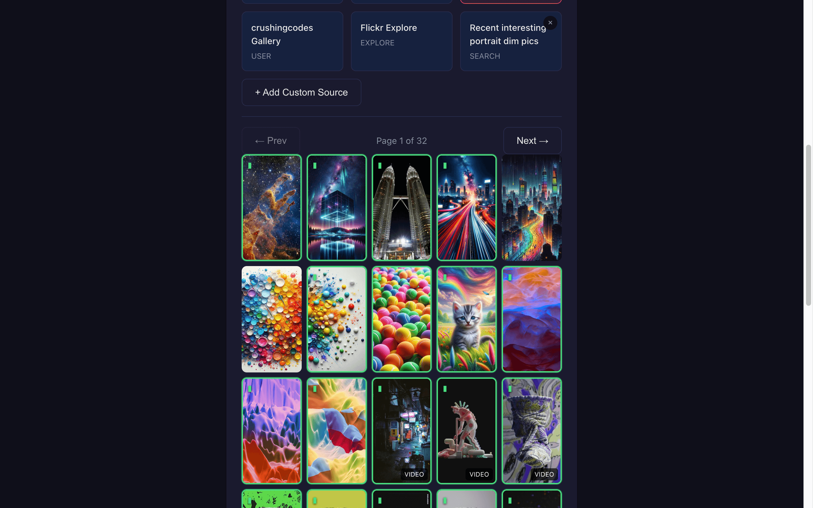
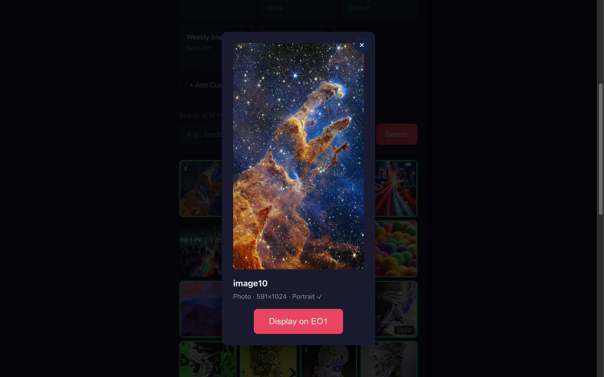

# EO1 Web Controller

A web-based interface for controlling the Electric Objects EO1 digital art display. Allows control from any device eg iPhone via Tailscale.

<p align="center">
  
  
</p>

## Quick Start

**Requirements:**
- [Node.js 18+](https://nodejs.org/)
- [Flickr Pro account](https://www.flickr.com/account/upgrade/pro) with [API key](https://www.flickr.com/services/apps/create/)
- EO1 with [spalt/EO1](https://github.com/spalt/EO1) app installed

```bash
git clone https://github.com/davemac/eo1-web-controller.git
cd eo1-web-controller
npm install
npm start
```

Open http://localhost:3000 and configure your Flickr API key in Settings.

---

## Features

### Device Control
- **Skip/Resume**: Advance to the next image in slideshow
- **Brightness**: Manual slider or auto-brightness using the EO1's light sensor (still buggy)
- **Screen On/Off**: Quick toggle to turn display on or off
- **Quiet Hours**: Configure when the display should sleep
- **Network Scanner**: Find EO1 devices on your network

### Flickr Browser
- **Multiple Source Types**: Browse user photos, tags, groups, galleries, and albums
- **Portrait Detection**: Photos are analysed for orientation - portrait images (optimised for EO1's vertical display) are highlighted with a green border
- **Landscape Warning**: When selecting a landscape image, you're warned it may not display optimally
- **Preview Before Display**: Click any thumbnail to see a larger preview with dimensions and orientation info
- **Pagination**: Browse through large collections page by page

### Presets
- **Built-in Community Sources**: Pre-configured access to community art collections
- **Custom Sources**: Save any Flickr URL as a preset (users, tags, groups, galleries, albums)
- **Delete Custom Presets**: Remove presets you no longer need

### Now Displaying
- **Current Source Info**: See what's currently showing on your EO1
- **Thumbnail Preview**: Visual confirmation of the current image
- **Quick Actions**: Skip and brightness controls always visible

## Prerequisites

**This web controller is a companion to the [spalt/EO1](https://github.com/spalt/EO1) replacement Android app.** You must have that app installed on your EO1 device first.

### Background

The Electric Objects EO1 is a discontinued digital art display. When Electric Objects shut down in 2023, their servers went offline and all devices got stuck at the "Getting Art" screen. Community member Dan Spalt created an open-source replacement app that brings the device back to life using Flickr as the image backend.

### Device Setup

1. **Install the spalt/EO1 app** on your EO1 device - follow the [setup instructions in their README](https://github.com/spalt/EO1#readme)
2. **Get a Flickr API key** (see below)
3. **Configure the spalt/EO1 app** with your Flickr User ID and API key

Once the spalt/EO1 app is running on your device and displaying images, you can use this web controller to browse Flickr and send images to the display.

### Getting a Flickr API Key

Since 2024, **Flickr Pro is required** to create API apps. Free accounts are blocked.

1. **Get Flickr Pro** - [$8/month or $72/year](https://www.flickr.com/account/upgrade/pro)
2. **Create a Flickr App** at [flickr.com/services/apps/create/](https://www.flickr.com/services/apps/create/)
   - Choose "Apply for a Non-Commercial Key"
   - Fill in app name and description (anything is fine)
3. **Copy your API Key** - you'll see it on the confirmation page
4. **Find your User ID** - use [idGettr](https://www.webfx.com/tools/idgettr/) (paste your Flickr profile URL)

You only need the **API Key** - not the API Secret.

## Configuration

All settings are configured through the web interface at http://localhost:3000:

1. **Flickr API Key** - Enter in Settings → Flickr API Settings
2. **Device IP** - Auto-detected or enter manually in Settings → Device Settings
3. **Slideshow Settings** - Interval and quiet hours in Settings → Slideshow Settings

Settings are saved to `config/settings.json` and persist between restarts.

### Configuration Priority

The app uses this priority chain for settings:

1. **`config/settings.json`** - Saved via web UI (highest priority)
2. **`.env`** - Environment variables (fallback)
3. **`config/default.json`** - Built-in defaults (lowest priority)

### Custom Server Port

To run on a different port, create a `.env` file:

```bash
cp .env.example .env
# Edit PORT=3000 to your preferred port
```

## Usage

### Development (with auto-reload)
```bash
npm run dev
```

### Production
```bash
npm start
```

Access the interface at `http://localhost:3000`

### Access via Tailscale

With [Tailscale](https://tailscale.com/) you can control your EO1 from anywhere - not just your home network.

1. Install Tailscale
2. Sign in to the same Tailscale account on both devices
3. Find your Mac's Tailscale IP:
   - **Option A:** Run `tailscale ip -4` in Terminal
   - **Option B:** Visit [login.tailscale.com/admin/machines](https://login.tailscale.com/admin/machines) - your IP is in the "Addresses" column
4. Start the server: `npm start`
5. On browser and go to `http://[your-tailscale-ip]:3000`

Example: If your Tailscale IP is `100.95.175.83`, use `http://100.95.175.83:3000`

## Built-in Presets

These community resources are pre-configured:

| Preset | Type | Description |
|--------|------|-------------|
| **Flickr Explore** | Explore | [Flickr's curated interesting photos](https://www.flickr.com/explore/) - daily updated selection |
| **Community Art** | Tag | Photos tagged [`electricobjectslives`](https://www.flickr.com/photos/tags/electricobjectslives/) - shared by EO1 owners |
| **Video Loops** | Tag | Photos tagged [`jadsmp4s`](https://www.flickr.com/photos/tags/jadsmp4s/) - ~160 MP4 video loops |
| **crushingcodes Gallery** | User | [Curated art collection](https://www.flickr.com/photos/157826401@N07/) by crushingcodes |

### More Community Resources

- **[r/electricobjects](https://www.reddit.com/r/electricobjects/)** - Reddit community often shares Flickr links

## Adding Custom Sources

1. Click **"+ Add Custom Source"**
2. Paste a Flickr URL:
   - User photos: `https://www.flickr.com/photos/username/`
   - Tag search: `https://www.flickr.com/photos/tags/nature/`
   - Group pool: `https://www.flickr.com/groups/groupname/pool/`
   - Gallery: `https://www.flickr.com/photos/username/galleries/12345/`
   - Album: `https://www.flickr.com/photos/username/albums/12345/`
   - Explore: `https://www.flickr.com/explore/`
   - Search with filters: `https://www.flickr.com/search/?text=nature&orientation=square`
3. Give it a name
4. Click Save

## Portrait vs Landscape

The EO1 has a 23" display in portrait orientation (1080x1920 pixels). Images work best when they match this orientation:

- **Portrait images** (height > width): Highlighted with a green border and `▮` icon
- **Landscape images** (width > height): Shown with reduced opacity
- **Square images**: Displayed normally without indicators

When you try to display a landscape image, you'll see a warning but can still proceed.

## Troubleshooting

### Port already in use
Both `npm start` and `npm run dev` automatically kill any process on port 3000 before starting. If you're running `node server.js` directly, you may need to manually free the port:

**macOS/Linux:**
```bash
lsof -ti:3000 | xargs kill -9
```

**Windows (PowerShell):**
```powershell
Stop-Process -Id (Get-NetTCPConnection -LocalPort 3000).OwningProcess -Force
```

### Can't find EO1 device
1. Ensure EO1 is on the same network as your computer
2. Use the "Scan for EO1" button in Device Settings
3. Verify the EO1 is running the spalt/EO1 app (not the original Electric Objects app)

### EO1 not responding to commands
- Check the spalt/EO1 app is running on the device (not stuck at "Getting Art")
- The device must be awake (not in Quiet Hours mode)
- Try power-cycling the EO1
- For device-specific issues, see the [spalt/EO1 issues](https://github.com/spalt/EO1/issues)

### Flickr API errors
- Ensure you have a Flickr Pro account (required for API apps since 2024)
- Check your API key is correctly entered in Settings → Flickr API Settings

## For Developers

See [ARCHITECTURE.md](ARCHITECTURE.md) for API endpoints, socket protocol, and project structure.

## Related Projects

- [spalt/EO1](https://github.com/spalt/EO1) - The replacement Android app for EO1
- [Electric Objects Revival](https://feeltrain.com/blog/hack-your-eo1/) - Community hack guide
- [5khz Teardown](https://www.5khz.com/2016/05/01/electric-objects-eo1-digital-art-display-teardown/) - Hardware teardown

## Acknowledgements

Huge thanks to **[Dan Spalt](https://github.com/spalt)** for creating the [spalt/EO1](https://github.com/spalt/EO1) replacement app. When Electric Objects shut down and left thousands of beautiful displays as expensive paperweights, Dan stepped up and built an open-source solution that brought them back to life. This web controller wouldn't exist without his work.

Thanks also to the EO1 community on [r/electricobjects](https://www.reddit.com/r/electricobjects/) for keeping these devices alive and sharing art through tags like `ElectricObjectsLives`.

## Licence

MIT
